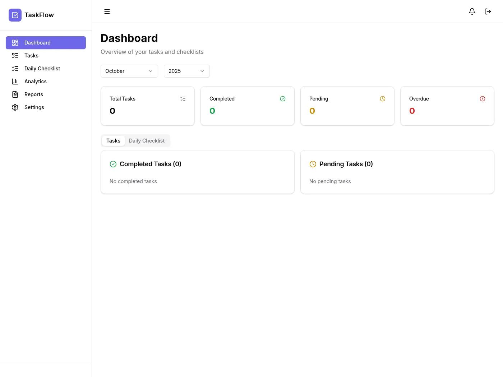
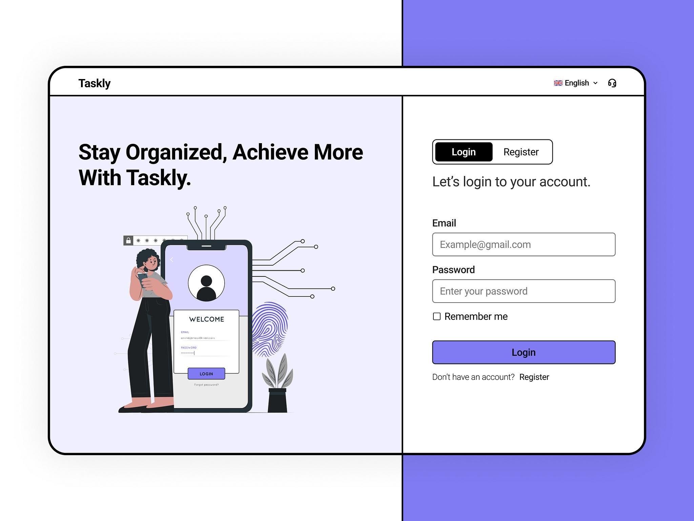
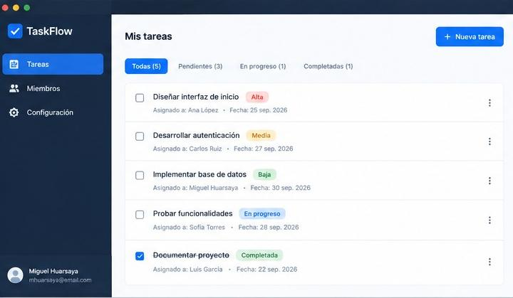
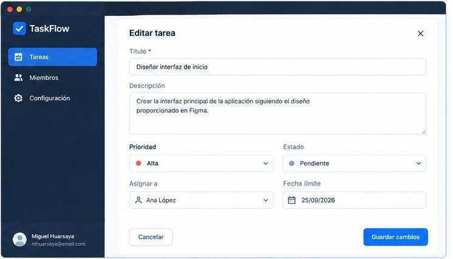
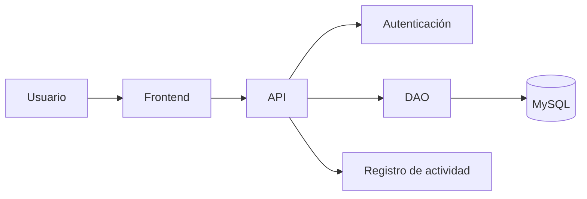

# TaskFlow


### Aplicación web para la gestión de tareas en equipo

## Tabla de contenidos

- [Descripción](#descripción)
- [Funcionalidades](#funcionalidades)
- [Tecnologías utilizadas](#tecnologías-utilizadas)
- [Requisitos](#requisitos)
- [Instalación](#instalación)
- [Uso](#uso)
- [Capturas de pantalla](#capturas-de-pantalla)
- [Arquitectura](#arquitectura)
- [Estructura del proyecto](#estructura-del-proyecto)
- [Contribuidores](#contribuidores)
- [Licencia](#licencia)

## Descripción

TaskFlow es una aplicación conceptual diseñada para facilitar la
organización y administración de tareas dentro de un equipo de trabajo.

Permite registrar, editar, eliminar y asignar tareas a diferentes
usuarios, facilitando el seguimiento de las actividades y la
organización del trabajo.

## Funcionalidades

- Registrar nuevas tareas.
- Editar tareas existentes.
- Eliminar tareas.
- Asignar tareas a los usuarios.
- Consultar las tareas registradas.

### Checklist de funcionalidades

- [x] Registrar tareas
- [x] Editar tareas
- [ ] Eliminar tareas
- [ ] Asignar tareas a usuarios
- [ ] Consultar las tareas registradas

## Tecnologías utilizadas

| Tecnología | Descripción |
|---|---|
| HTML5 | Estructura de las interfaces |
| CSS3 | Diseño y estilos de la aplicación |
| JavaScript | Interactividad de la aplicación |
| Git | Control de versiones |
| GitHub | Alojamiento del repositorio |

## Requisitos

Para utilizar el proyecto se requiere:

- Un navegador web actualizado.
- Git instalado para clonar el repositorio.
- Un editor de código, como Visual Studio Code.

## Instalación

1. Clonar el repositorio:

   ```bash
   git clone https://github.com/mhuarsayac/TaskFlow.git
   ```

2. Ingresar a la carpeta del proyecto:

   ```bash
   cd TaskFlow
   ```

3. Abrir la carpeta del proyecto en Visual Studio Code.

4. Abrir el archivo `index.html` en un navegador web
   para visualizar la interfaz.

## Uso

1. Abrir la aplicación en el navegador.
2. Acceder a la interfaz principal.
3. Explorar las opciones de gestión de tareas.
4. Consultar las interfaces de registro y edición.
5. Revisar las funcionalidades representadas en el prototipo.

## Capturas de pantalla

### Página principal



### Registro o inicio de sesión



### Gestión de tareas



### Edición de tareas



## Arquitectura

La arquitectura conceptual de TaskFlow está organizada
en diferentes componentes que permiten gestionar la
interacción con el usuario, la autenticación, el acceso
a datos y el registro de actividades.



## Estructura del proyecto

```text
TaskFlow/
├── img/
│   ├── pantallaprincipal.jpg
│   ├── login-register.jpg
│   ├── gestion-tareas.jpeg
│   └── editor-tareas.jpeg
├── index.html
├── README.md
└── LICENSE
```

## Contribuidores

- Miguel Angel Huarsaya Carranza

## Licencia

Este proyecto es de carácter académico y conceptual.

La licencia de distribución está pendiente de definición.